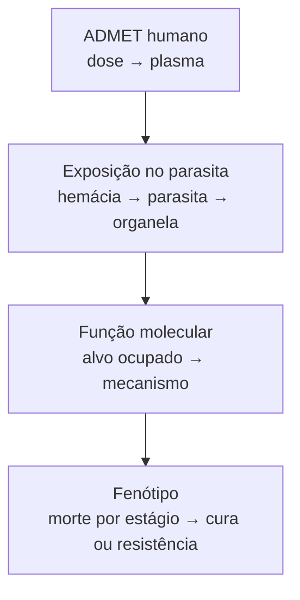

# Malaria Drug Action Engine

> **Do estrutura química ao fenótipo do parasita.** Um motor mecanístico, open-source, que calcula —
> para *Plasmodium falciparum* — a cadeia: **estrutura → exposição no compartimento do parasita →
> função molecular → morte por estágio → resistência**.

*Nome de trabalho — pode mudar (Virtual Plasmodium / Parasite Digital Pharmacology). O código usa
nomes genéricos pra um rename não custar nada.*

> **EN / TL;DR:** an open-source mechanistic engine for antimalarial drug action. Most tools stop at
> "the molecule binds". Antimalarial ADME does **not** end in plasma — there is a *second ADME* into
> the parasite's compartments (RBC → infected RBC → parasitophorous vacuole → parasite → organelle).
> This engine models that second ADME plus molecular function and stage-specific killing, starting
> from chemical structure. Built to help malaria researchers, especially in Brazil.

---

## O problema (os três muros)

Docking te diz que a molécula **liga**. Ensaio celular te diz que ela **mata**. Quase nada te diz
**por que** — e, crucialmente, se a droga chega no alvo, e em que concentração livre. Pra um
antimalárico o ADME não termina no plasma: a droga ainda precisa atravessar a membrana da hemácia, a
hemácia infectada, o vacúolo parasitóforo, a membrana do parasita e chegar à organela certa. Isso é um
**segundo ADME** — e é onde este motor vive.

O caso canônico: **cloroquina**. A concentração plasmática parece suficiente, mas mutações em **PfCRT**
tiram a droga do vacúolo digestivo — a resistência não é "o binding piorou", é **a concentração local
que caiu**. Nenhum score de docking ou IC₅₀ isolado captura isso.

## O que é / o que não é

- ✅ **É** um motor mecanístico molécula→fenótipo específico dos compartimentos do *Plasmodium*.
- ❌ **Não é** um simulador de epidemiologia/transmissão — isso é [OpenMalaria](https://github.com/SwissTPH/openmalaria)
  e [EMOD](https://emod.idmod.org/). Não é um "corpo humano" genérico.

## As quatro camadas

| Camada | Pergunta | Objeto governante |
| --- | --- | --- |
| **A — ADMET humano** | dose → plasma? | `C_plasma(t)` (fornecido ou estimado) |
| **B — Exposição no parasita** *(o núcleo novo)* | a droga chega ao alvo, e em que concentração livre? | `C_free_{s,o}(t)` ao longo de plasma→hemácia→iRBC→PV→parasita→organela |
| **C — Função molecular** | ligou — e fez o quê? | `F(t)=f(C_free, K_d, K_i, mecanismo)` |
| **D — Fenótipo** | mata? quando? em qual estágio? | `dN_s/dt = g_s·N_s − k_s(F, estado, resistência)·N_s` |

## MVP e escada de validação

**MVP:** preditor de exposição no local de ação + efeito funcional em *P. falciparum* estágio sanguíneo.

1. **Cloroquina–PfCRT–vacúolo digestivo** — benchmark de transporte, compartimento e resistência
   (com oráculo analítico de ion trapping / Henderson-Hasselbalch).
2. **Um inibidor enzimático** — binding-to-function quantitativo.
3. **Artemisinina** — ativação por heme, múltiplos alvos, dependência de estágio.
4. Depois: apicoplasto / *delayed death*, fígado, combinações, recrudescência.

Retrodizer a cloroquina é *necessário mas não suficiente* — o motor tem que **prever compostos e
mutações que não foram usados pra construí-lo**. Senão é só ajuste de curva.

## Doutrina (inegociável)

1. **Verdade antes de novidade** — nenhuma claim de "primeiro" sem varredura sistemática de literatura + patente.
2. **Toda claim de mecanismo/pKa/pH citada na fonte primária.**
3. **Mecanístico onde há parâmetro; estimador empírico (QSPR) explícito onde não há** — sem fator de fudge escondido.
4. **Incerteza é saída de primeira classe.**
5. **Retrodizer, depois prever.**
6. **A camada de morte (D) é o elo mais fraco — e a gente fala isso.**

## Estado

**Layer B — fatia 1 validada.** Já roda: modelo de ion trapping da cloroquina no vacúolo digestivo
+ efluxo do PfCRT, reproduzindo a resistência por *exposição* e checado contra o oráculo analítico
de Henderson-Hasselbalch (6/6 testes). Rate constants ainda ilustrativas — o próximo passo é
ancorá-las em dados reais de PfCRT (ver escada de validação).

## Repositório

- `src/mdae/` — o pacote: `speciation` (frações neutra/carregada por pH), `oracle` (razão de acúmulo
  analítica), `exposure` (ODE de ion trapping + efluxo PfCRT), `function` (ocupação/threshold),
  `parameters` (cada valor com proveniência).
- `examples/chloroquine_pfcrt.py` — a história mecanística sensível vs resistente.
- `tests/test_slice1.py` — validação (`PYTHONPATH=src python3 tests/test_slice1.py`).

Stack: **Python** (NumPy, SciPy; RDKit/JAX conforme crescer). A camada estrutura→binding reusa
docking existente (gnina, Vina-GPU) e, pros termos físicos de partição/permeação de membrana,
dinâmica molecular (PMF de bicamada).

## Como contribuir

A meta é crescer como projeto aberto pra **auxiliar pesquisadores de malária no Brasil todo** — e no
mundo. Contribuições bem-vindas: modelos de compartimento, parâmetros com fonte primária, casos de
validação, dados de PfCRT/K13, revisão de mecanismo. Abra uma *issue* descrevendo a camada (A/B/C/D) e
a fonte. Todo parâmetro entra com **proveniência + incerteza**.

## 💚 Apoie o projeto

Projeto open-source feito no tempo livre. Formas de apoio serão adicionadas em breve
(PIX via chave aleatória; plataformas de doação a definir).

## Licença

[Apache License 2.0](LICENSE) — permissiva, com concessão explícita de patente. Ver [`NOTICE`](NOTICE).

## Agradecimentos

Construído ao lado do motor MD **SHARP** e do pipeline de docking **PfPK2** (gnina, Vina-GPU).
Referência de fundo: [revisão sobre acesso de antimaláricos aos alvos intracelulares](https://pmc.ncbi.nlm.nih.gov/articles/PMC4419668/).
